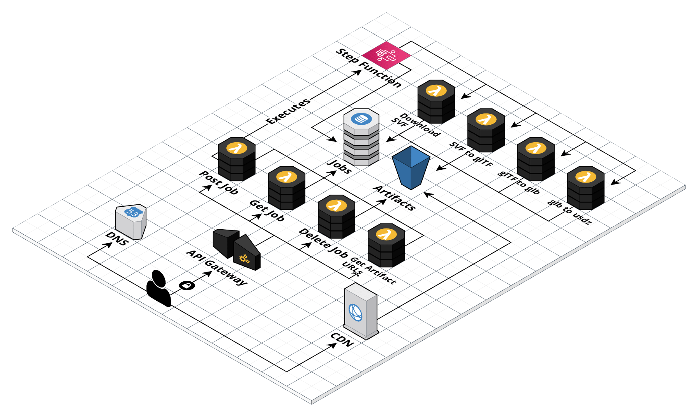
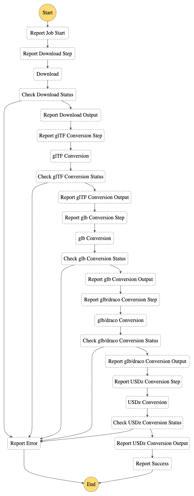
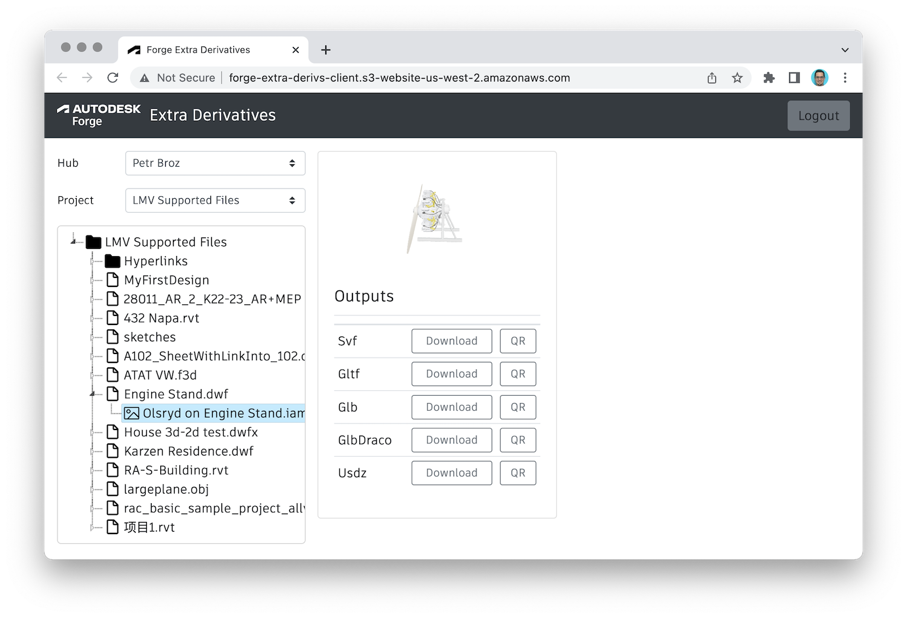

# forge-extra-derivatives-aws

Experimental AWS serverless architecture for post-processing 3D models from [Autodesk Forge](https://forge.autodesk.com)
to additional formats such as [glTF, glb](https://www.khronos.org/gltf), or [Usdz](https://graphics.pixar.com/usd/release/wp_usdz.html).

## Architecture

Here's a quick description of the different resources used in the AWS SAM template:

- _JobsTable_ - DynamoDB table storing the status of conversion jobs and their artifacts
- _ArtifactsBucket_ - S3 bucket storing the conversion artifacts
- _RestApi_ - REST API definition with CORS settings
- _GetJobFunction_ - Lambda function (Node.js) handling `GET` requests
- _PostJobFunction_ - Lambda function (Node.js) handling `POST` requests
- _GenerateArtifactUrlsFunction_ - Lambda function (Node.js) handling `POST` requests that generate temporary signed URLs for artifacts
- _ConversionStateMachine_ - Step Function orchestrating individual steps of the conversion
- _DownloadSvfFunction_ - Lambda function (Node.js) handling the downloading of SVF assets from Forge
- _ConvertSvfToGltfFunction_ - Lambda function (Node.js) converting SVF assets to glTF
- _ConvertGltfToGlbFunction_ - Lambda function (Node.js) converting glTF to glb
- _ConvertGltfToDracoFunction_ - Lambda function (Node.js) converting glTF to glb with Draco compression
- _ConvertGltfToUsdzFunction_ - Lambda function (Python) using a custom Docker image to convert glb to usdz
- _SharedLayer_ - Lambda layer with shared code and dependencies for all Node.js-based Lambda functions

The _ConversionStateMachine_ consists of the following states:

## Experimental Usage

### REST API

1. Use the `POST https://m5ey85w3lk.execute-api.us-west-2.amazonaws.com/Prod/jobs/{urn}/{guid}` request to process a specific Forge model viewable.
2. Use the `GET https://m5ey85w3lk.execute-api.us-west-2.amazonaws.com/Prod/jobs/{urn}/{guid}` request to check the status of the processing.
3. Use the `POST https://m5ey85w3lk.execute-api.us-west-2.amazonaws.com/Prod/jobs/{urn}/{guid}/signedurl` to generate temporary, read-only
signed URLs for downloading the different artifacts.

In all the requests listed above, replace `{urn}` with the Model Derivative URN of your model, and
`{guid}` with the GUID of the specific viewable you want to process, and provide an `Authorization`
header with the same token you would use in requests to the Model Derivative service.

> Tip: viewables are listed in the Model Derivative manifest with `"mime": "application/autodesk-svf"`.

### Demo App

Go to [http://forge-extra-derivs-client.s3-website-us-west-2.amazonaws.com](http://forge-extra-derivs-client.s3-website-us-west-2.amazonaws.com),
log in with your Autodesk account, browse through your hubs, projects, and designs. After selecting a specific viewable of a design,
start the conversion process (unless you have already done so in the past), wait for it to complete, and then download or preview
the conversion outputs.

